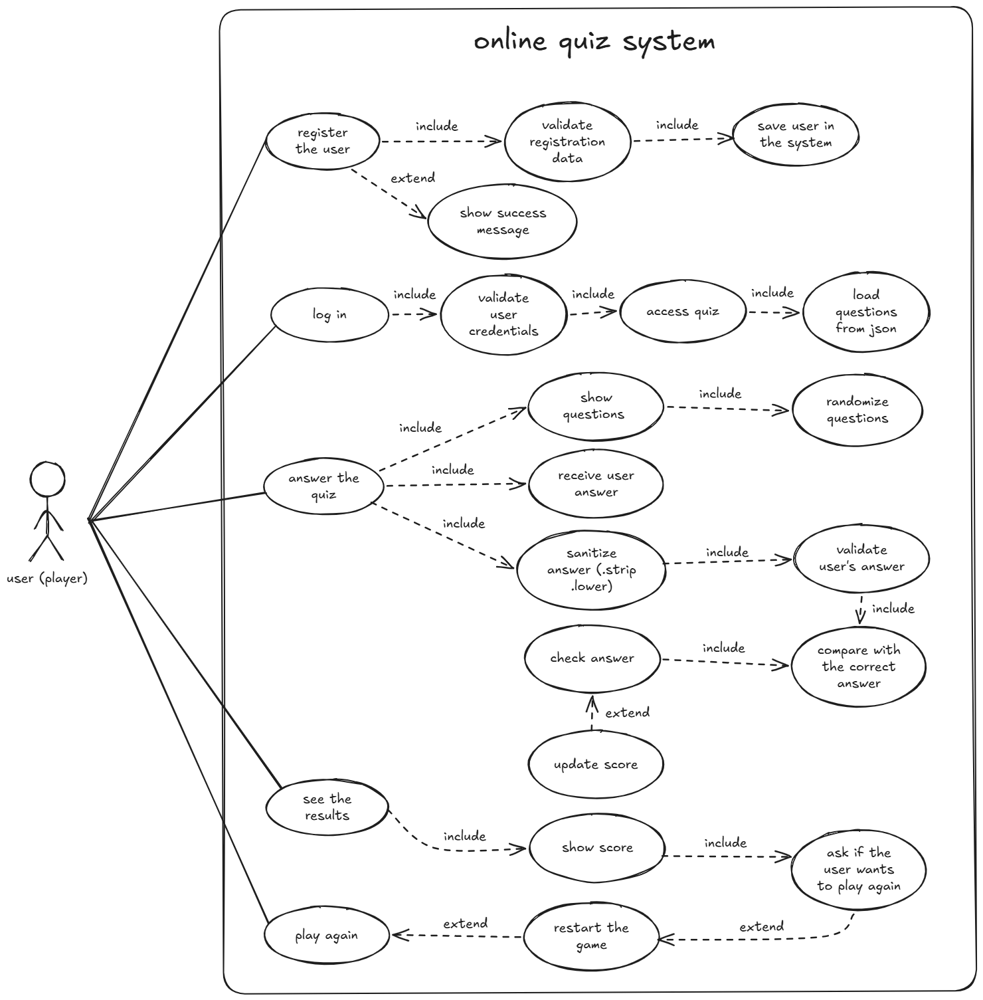

# Quiz de Perguntas

## Integrantes da Equipe

- Izabela Rocha
- Isabela Silva
- Beatriz Rocha
- Clara Silva

## Sobre o Projeto

O Quiz de Perguntas é um projeto desenvolvido em Python com o objetivo de criar uma experiência simples e interativa de perguntas e respostas.

Antes de iniciar o quiz, o usuário deverá realizar um cadastro, informando seus dados. Após o cadastro, poderá responder às perguntas apresentadas pelo sistema, digitando sua própria resposta, sem receber alternativas sugeridas.

Ao final, o sistema verificará as respostas e apresentará a pontuação do usuário.

## Problema Resolvido

O projeto busca criar uma maneira simples e interativa de testar os conhecimentos dos usuários.

Diferente de quizzes que apresentam alternativas prontas, este projeto permite que o usuário escreva sua própria resposta. Dessa forma, ele precisa lembrar e digitar a resposta que considera correta.

## Objetivo

O principal objetivo é desenvolver um quiz funcional utilizando conceitos básicos da linguagem Python.

O projeto também permite que a equipe pratique conceitos importantes de programação, como:

- Variáveis;
- Listas;
- Dicionários;
- Estruturas condicionais;
- Funções;
- Loops;
- Entrada de dados com `input`;
- Cadastro e armazenamento de informações;
- Contagem de pontos.

## Cadastro do Usuário

Antes de começar o quiz, o usuário deverá realizar um cadastro.

O sistema poderá solicitar informações como:

- Nome;
- Idade;
- Nome de usuário.

Após preencher o cadastro, o usuário poderá iniciar o quiz.

As informações cadastradas serão utilizadas para identificar o participante e apresentar seu resultado ao final.

## Funcionalidades do MVP

O MVP (Produto Mínimo Viável) contará com as seguintes funcionalidades:

1. Cadastrar o usuário antes do início do quiz.
2. Armazenar as informações básicas do usuário.
3. Apresentar perguntas ao usuário.
4. Permitir que o usuário digite sua própria resposta.
5. Verificar se a resposta está correta.
6. Adicionar pontos a cada resposta correta.
7. Manter a pontuação durante o quiz.
8. Exibir o resultado final.
9. Informar a quantidade de acertos do usuário.

## Estrutura de Dados

As informações do usuário e as perguntas poderão ser organizadas utilizando listas e dicionários em Python.

Exemplo de cadastro:

```python
usuario = {
    "nome": "Izabela",
    "idade": 16,
    "usuario": "izabela01"
}
## Diagrama de Funcionamento

O fluxo do sistema começa com o cadastro do usuário. Após o cadastro,
o usuário inicia o quiz e responde às perguntas digitando suas próprias
respostas. O sistema verifica cada resposta, contabiliza os acertos e,
ao final, apresenta a pontuação.

### Fluxograma

Início → Cadastro → Iniciar Quiz → Pergunta → Resposta → Verificação
→ Pontuação → Próxima Pergunta → Resultado Final → Fim


```

